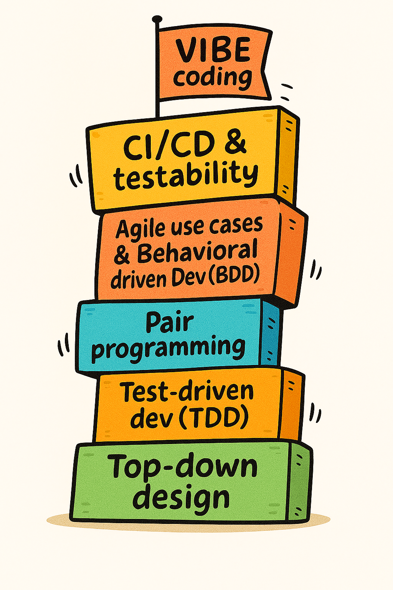

# GenAI generated  code quality compare 

## Purpose: compare quality of  structured, reusable prompts,
 * try code generation for multiple LLMs to understand differences and
   if/where there is a value sweet-spot. 
 * understand reusable common snippets
 *  [View _common_prompt_snippet.txt](prompts/_common_prompt_snippet.txt)
 
 The prompts and generated python files are very simple, open source.
 They are all functional style - simple parts of a data analytics, pandas-based pipeline
 
 
 ##  ./bin/pyquality.sh -  wrapper to run a few python code quality checks. 
	 
	 Metrics: 
	 * lines - total lines including comments (wc)
     * pylint - pylint score 
     * flake 8: 
     * radon_cc: Radon code complexity
     * radon_mi: Radon code maintainability
     * bandit_out: Bandit
     * MyPy: Mypy summary
	 
 ### run
Start from root directory

```bash
~/bin/pyquality.sh  "./generated/copilot/*.py"


# Results


## Copilot

| File Name                                        |lines |py lines| Pylint | Flake8   | radon_cc| radon_mi| bandit_out| MyPy  |
|-------------------------------------------------|------|--------|--------|----------|---------|---------|---------|---------|
|./generated/copilot/calc_app_usage_metrics.py    |60    |      35| 6.52   |        4 | 11.0    | A       | 0       | broken  |
|./generated/copilot/calc_usage_metrics.py        |83    |      56| 7.17   |       12 | 6.0     | A       | 0       | broken  |
|./generated/copilot/combine_usage_files.py       |74    |      51| 6.92   |        7 | 12.0    | A       | 0       | broken  |
|./generated/copilot/count_app_users.py           |43    |      29| 6.25   |        4 | 6.0     | A       | 0       | broken  |
|./generated/copilot/csv_str_parse.py             |37    |      24| 9.38   |        1 | 9.0     | A       | 0       | broken  |
|./generated/copilot/gen_readme.py                |55    |      39| 7.14   |        1 | 8.0     | A       | 0       | broken  |
|./generated/copilot/write_period_excel.py        |77    |      58| 6.40   |        5 | 7.0     | A       | 0       | broken  |

## Grok 

| File Name                                        |lines |py lines| Pylint | Flake8   | radon_cc| radon_mi| bandit_out| MyPy  |
|-------------------------------------------------|------|--------|--------|----------|---------|---------|---------|---------|
| ./generated/grok/calc_app_usage_metrics.py       |63    |      39| 4.80   |        7 | 11.0    | A       | 0       | broken  |
| ./generated/grok/calc_usage_metrics.py           |104   |      73| 6.35   |       15 | 8.0     | A       | 0       | broken  |
| ./generated/grok/combine_usage_files.py          |102   |      71| 6.15   |       17 | 13.0    | A       | 0       | broken  |
| ./generated/grok/count_app_users.py              |48    |      31| 3.33   |        4 | 6.0     | A       | 0       | broken  |
| ./generated/grok/csv_str_parse.py                |48    |      29| 10.00  |        1 | 10.0    | A       | 0       | broken  |
| ./generated/grok/gen_readme.py                   |46    |      27| 5.33   |        6 | 9.0     | A       | 0       | broken  |
| ./generated/grok/strip_quotes.py                 |37    |      21| 9.23   |        3 | 6.0     | A       | 0       | broken  |
| ./generated/grok/write_period_excel.py           |67    |      49| 5.19   |        5 | 9.0     | A       | 0       | broken |

notes:  
 * keep any file wildcards in quotes
 *mypy may complain to install stubs =, such as  python3 -m pip install pandas-stub
	 
	 
	 


## Manual Process
1. Manual - I copy each prompt into a LLM chat window and then copy-paste the generated files into a local py file. 
2. See ./prompts/_common_prompt_snippet.txt

## Running

### create and activate venv if needed
1. python3 -m venv .venv
2. source .venv/bin/activate
   or .venv\Scripts\Activate.ps1
3. pip install -r requirements.txt


## Futures - improvements

1. Update to generate results in markdown format
2. Write script to make sure every prompt has the latest common prompt snippet.
    * Maybe by combining at generation time or by modifying each prompt file (boo) 
2. Generate source files from command line
3. Try harder code. 
4. Consider a few loops - generate code - then ask LLM to evaluate and improve code. 


 # Codegen in the SDLC - observations

Personal opinons from using genAI to generate useful code.

 1. Summary of GenAI Code Gen
	1. Great for individual productivity.  Provided…
		a. Generated code is small and tight. 
		b. Does one thing well.  Single Responsibility Principle (SRP) 
		c. Is fully testable.  That is, you can test interface and all side-effects (memory, scale, security, etc.) 
	2. Quality code requires discipline to create comprehensive prompts,  (but lots of reuse)
	3. Responsibility recommendation:   Dev that introduces code into codebase is fully responsible.  
	4. What is your project's authoritative source of correctness? 
		a. the test case code (test-driven development) or the extremely detailed prompt that defines the test cases?        
 2. Treat code gen like an JR dev that is very fast, smart and wants to please
	1. Speed > wisdom. They will give you what you asked for … but no more. 
	2.  Imagine they solved every thing with the first entry on stackoverflow. 
	3. Especially for things that require experience: 
		a. security, big scale/perf, availability, logging without leaking (don't log session tokens or secrets), avoiding N^2 algos, cost, maintainability, etc. 

 3. Code Gen & Vibe coding - Powerful, but really only incremental step in SW dev

Kind of like how agile manifesto pulled together multiple successful SW team iterative dev patterns into Agile/Scrum, vibe coding is an natural extension to incremental improvements to SW process. 

 


|Level         |          Notes                          |
|--------------|-----------------------------------------|
| CI/CD & testability |	Shift left. Tests are always commited with code. Human out-of-the-loop for comprehensive quality checks. |
| Agile use cases & Behavioral driven Dev (BDD)	| Agile use cases. Focus on business process, not tech. Durable module interfaces with fluid UX and implementations. Cucumber, etc. | 
| Pair programming | One user thinks functionality and strategy, the other thinks syntax and code. |
| Test-driven dev (TDD)	| Think about what CORRECT means in your business case. Write tests - or at least enumerate them. 	Tests make sure you signature / behavior doesn't change with revisions.  | 
| Modularized, Decoupled. |	Programming in the small.    Stable/Durable signatures / interfaces |
| Top-down design	| Think through business problem and requirements before coding. | 


 4. Recommended Paper: Does AI Actually Boost Developer Productivity? (100k Devs Study) - Yegor Denisov-Blanch, Stanford
	1. https://gist.github.com/Jarvis-Legatus/95885251ef9741c96cfc000ae4c4ba30
	2. Nice youtube.  - Does AI Actually Boost Developer Productivity? (100k Devs Study) - Yegor Denisov-Blanch, Stanford
	

	3. Summary: 
	* Greenfield - new or low complexity are the sweet spot.
	* Brownfield - complex or frequently edited.  Multiple edits & PRs are not a good fit. 
			

 5. Evaluating value of GenAI code tools - i.e., measuring value
	• What you are trying to learn?
	• What are you trying to optimize?   Is it better or faster than a human?
		○ In what cases?        
	• Consider Full Lifecycle to finished feature:  PRs, reviews, bugs, churn, etc
		○ Compare to your team's Definition of Done (DoD). 
	• Experiment: Senior dev creates very comprehensive prompt for a medium simple problem. Prompt is used both by a GenAI tool, as well as another human developer. The test should include test cases. 
		○ When completed: Have team code review both. What did you learn?
		○ Q: Could the prompt be improved to be closer to team’s production requirements?
		○ Q: Could the senior developer be faster if they started with the generated baseline. 

 6 . Store your comprehensive prompts in source tree. 
	1. Establish your or team standards for prompts.    
	2. Prompt Structure: 
		a. Top - functionality
		b. Bottom - consistent & reused.  PEP8, error handling, etc.    
	3. Why version? - You may want to express the functional requirements in different technology some day. 
		a. Including a different test framework. 
		b. They are iterative and versioned. 
 7. Team decisions - try these during your test:  
	1. Do you allow  generated code files to be edited after generation?  (if so they are no disconnected from prompt)
	2. Test cases:    Do you regenerate each time the prompt changes?   Or  add new tests to existing test file? 
		a. TDD like. 
		b. Consideration: backwards compatible signature & external behavior are critical
		c. Recommendation: Generate full test cases first and then add.     


 
